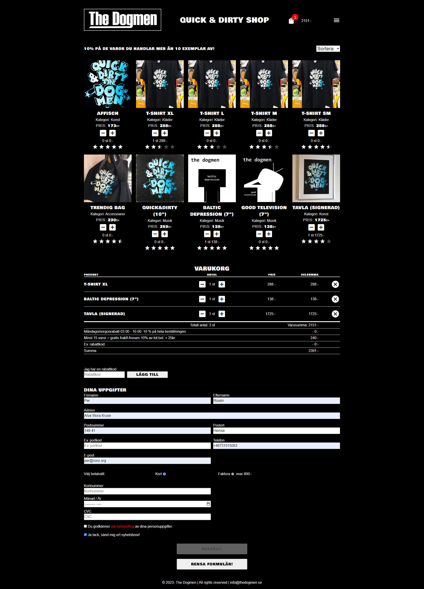
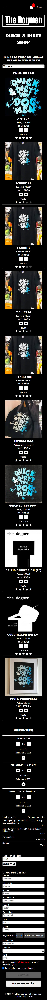
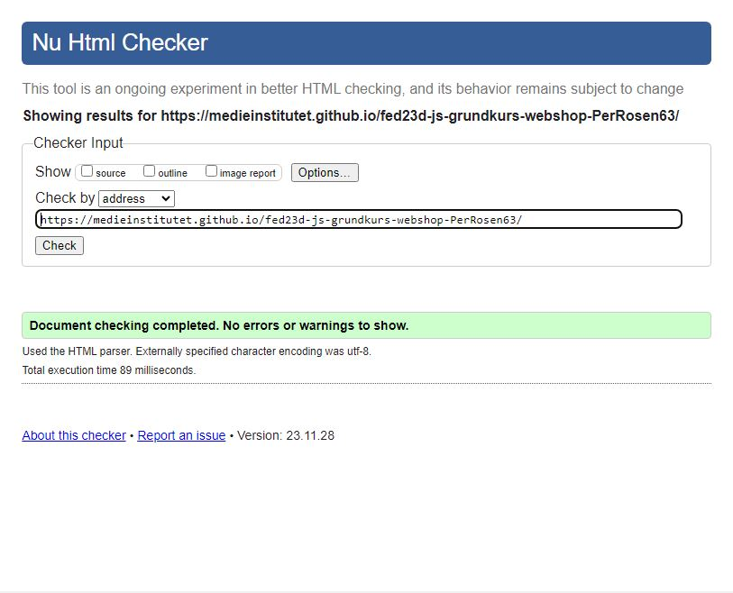
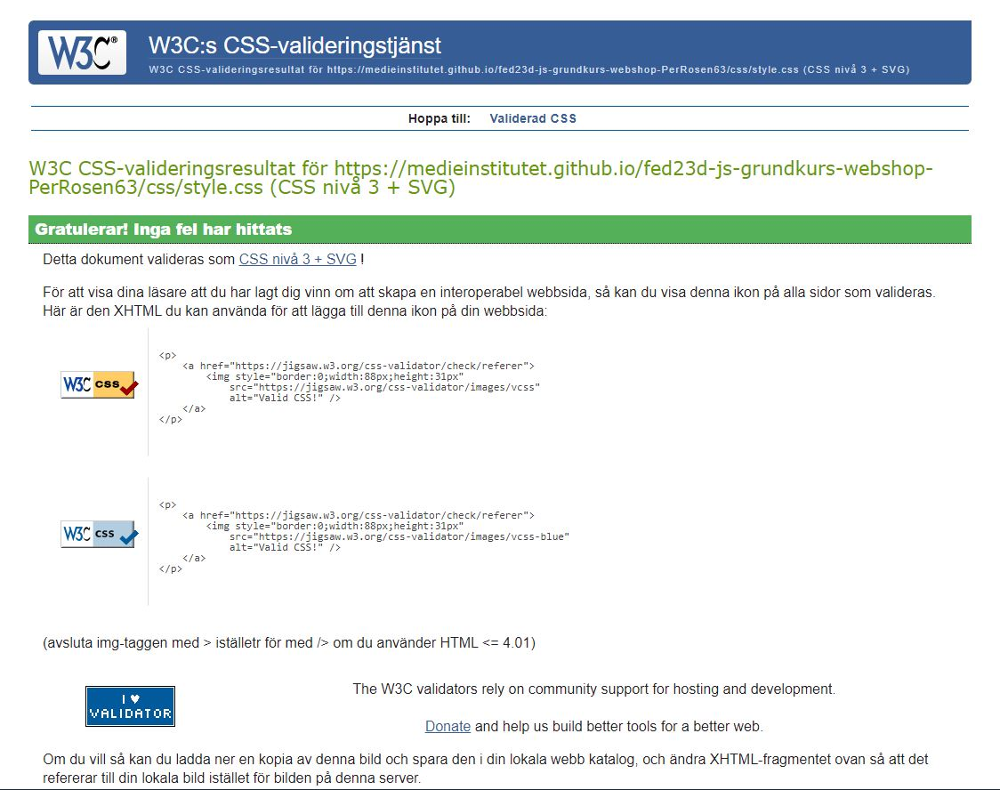
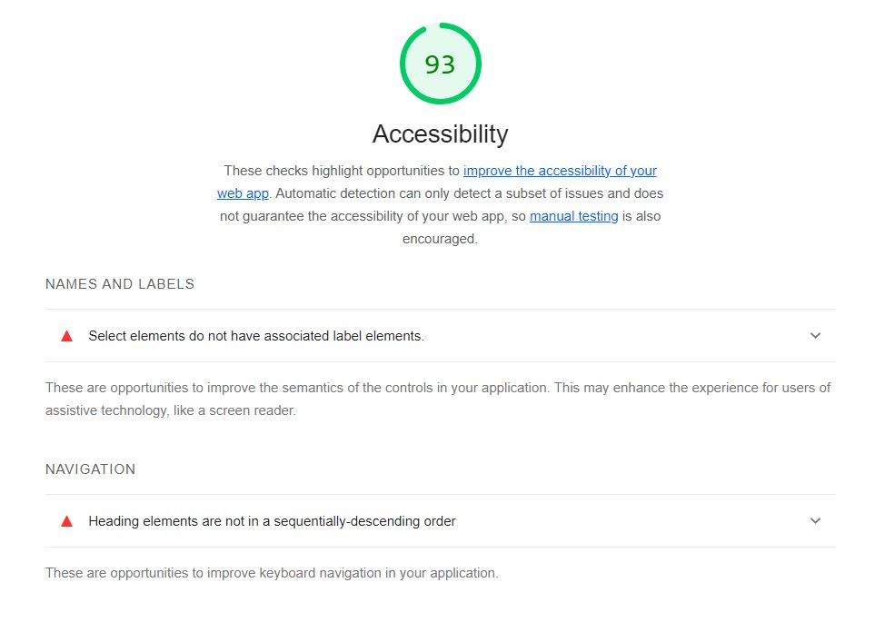

# Webbshop - inlämningsuppgift på delkursen JavaScript Grund i YH-programmet Front End Developer Distans 2023 på Medieinstitutet Stockholm

En webbshop på endast en html-sida där produkter, som hämtats in med hjälp av JS via en objekt-array, kan väljas med hjälp av plus- och minusknappar och läggas till i en egen varukorgsektion med delsummor, rabatter och avgifter, inklusive specialregler. Ett formulär med beställarens uppgifter valideras innan beställningsknapp görs tillgänglig. En sorteringsfunktion finns också.

## Lite om mig

Jag har under flera år jobbat med att bygga webbplatser t ex webbshoppar, främst i publiceringssystemet WordPress. Nu får jag chansen att lära mig hur det fungerar "under huven" beträffande de interaktiva delarna som styrs av JavaScript.

Den fiktiva webbshoppen säljer s.k. merch för ett i högsta grad existerande rockband.

## Teknik
- HTML
- CSS/SCSS
- javaScript

## Länk till webbsida

https://medieinstitutet.github.io/fed23d-js-grundkurs-webshop-PerRosen63/

## Screenshot desktop

## Screenshot mobile

## Validering

